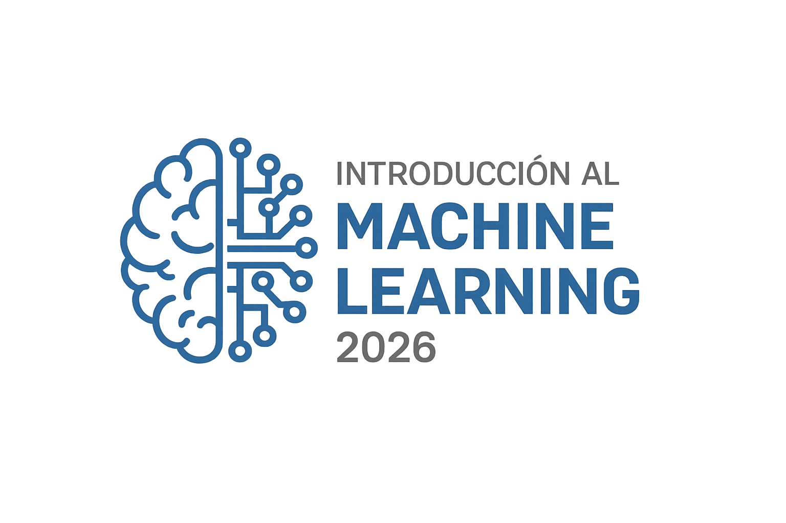

# Bienvenidos al taller de Machine Learning!

*Este taller ofrece una introducción a los principios de Machine Learning.  
El material ha sido desarrollado por:*

Iliomar Rodríguez Ramos y Juvenal Bassa

